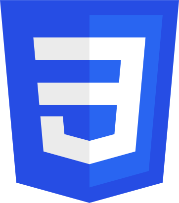
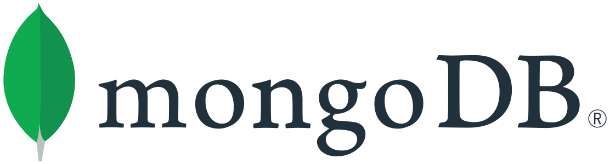
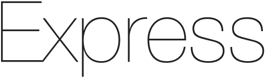
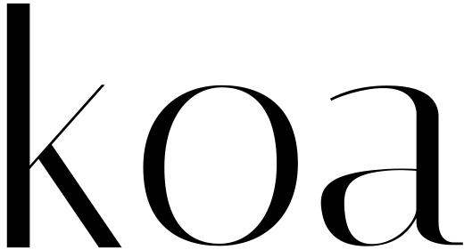
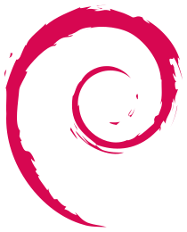

- ### Hallo 🖖!! It's Huss, full-stack developer from Alicante (located in Barcelona)

  I'm a full-stack developer, with more than 10 years experience in the tech world, specialized in JavaScript and React, and strong foundations in networking, C, Shell Scripting and Python

  When I am not coding, you can find me juggling with knives and pans in the kitchen 🥘 experimenting with new techniques and discovering new flavors, I also enjoy photography 📸, traveling and discovering new cultures 🌏, surfing 🏄, climbing, socializing with random people or just looking at the clouds thinking about the cosmos and what part do we play on it.

  

  ### What's alive in me nowadays

  - 🔭 I’m currently working on Plantopi, an automated irrigation system using IoT technologies, MQTT, NestJS & React.
  - 🌱 I’m currently learning React Native and the art of fermenting kombucha!
  - 👯 I’m looking to collaborate on any project that has an impact on this little rock we call Earth.
  - 💬 Ask me about docker, networks and typescript

  ### My domain

    
  

  

  
  
  

